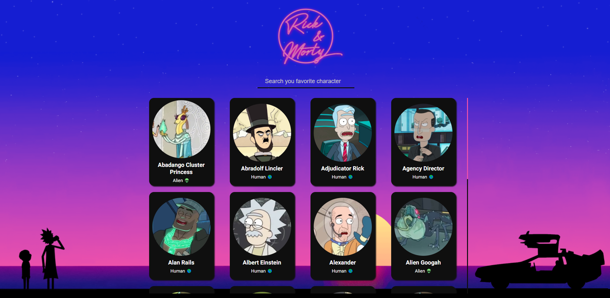

# Ejercicio de evaluación final con React - Módulo 3 Adalab

*Wubba Lubba Dub Dub!*

##  Enunciado

Este ejercicio forma parte de la evaluación final del módulo 3 del bootcamp Adalab. Consiste en desarrollar una página web utilizando el framework **React**. 

Se trata de un listado de personajes de **Rick and Morty**, que podemos filtrar por el nombre del personaje y además seleccionar para ver una ficha detallada del mismo.

Para desarrollar esta SPA he utilizado, entre otras, las siguientes tecnologías: **React, JavaScript **y** SASS**.

## Resultado final

## Jerarquía de componentes

Estos son los componentes y archivos con los que he trabajado:

- **App**: componente raíz del proyecto. Primero se encarga de recoger los datos del API haciendo uso del ciclo de vida de los componentes para evitar llamadas innecesarias a la misma. Dichos datos son recogidos en su estado, y pasados por props a sus componentes hijos. Además, recibe por lifting el evento y la información que la usuaria escribe en el campo de texto, la cual es utilizada para filtrar los nombres de los personajes que coincidan con dicho texto y renderizarlos en orden alfabético.
- **Header**: componente hijo de App. Se encarga de renderizar el header con su correspondiente logo en ambas páginas (la de tarjetas y la de detalle).
- **Filters**: componente hijo de App. Encargado de pintar el campo de texto que busca el nombre del personaje. Contiene  un evento que sube hasta App mediante lifting.
- **CharacterDetail**: componente hijo de App. Su función es renderizar en otra página la tarjeta de detalle de un personaje una vez la usaria la selecciona. Para ello he utilizado la librería React Router.
- **CharacterList**: componente hijo de App. Recibe por props los datos de su componente madre y se encarga de pintar una lista que contendrá, mediante un mapeo, cada una de las tarjetas de los personajes como un item dentro de dicha lista.
- **CharacterCard**: componente hijo de CharacterList y nieto de App. Se encarga de pintar el contenido dentro de cada tarjeta de personaje: cada una es un article que contiene una imagen, nombre y especie del personaje en cuestión.
- **CharacterNotFound**: componente hijo de CharacterList y nieto de App. Su función es renderizar un mensaje de texto que aparece cuando la usuaria busca un nombre que no existe.
- **api**: archivo dentro de la carpeta Service que recoge la llamada a la API mediante un fetch y además muestra un mensaje de error si la comunicación con el mismo falla. 

## Pasos realizados

A continuación se muestra una lista de las funcionalidades que he ido añadiendo a la página durante su desarrollo:

- [x] Plantear en papel la estructura de componentes para la web.
- [x] Crear una nueva aplicación React.
- [x] Obtener los datos del API mediante un fetch.
- [x] Pintar en pantalla los personajes.
- [x] Filtrar los personajes por nombre.
- [x] Pintar los detalles de personajes en otra página con React Router.
- [x] Detalles de calidad: 
  - [x] Campo de texto dentro de etiqueta form.
  - [x] Impedir que el navegador cambie de ruta o navegue al pulsar intro en el campo de texto.
  - [x] Mostrar mensaje cuando un personaje no se encuentra tras búsqueda.
  - [x] Filtrado de texto independientemente de mayúsculas o minúsculas.
  - [x] Tras entrar en el detalle de un personaje, al volver atrás el input mantiene el texto escrito antes.
- [x] Bonus: mejoras visuales y diseño responsive:
  - [x] Mostrar especie y si un personaje está muerto con un icono.
  - [x] Usar grid para listado de tarjetas de personajes.
  - [x] Implementar diseño responsive.
- [x] Bonus: URL de detalle de personajes compartible:
  - [x] Visitar detalle de personaje directamente escribiendo la URL.
  - [x] Mostrar mensaje cuando un personaje no existe a través de URL.
- [x] Bonus: ordenación de los personajes alfabéticamente en la búsqueda.

## Nuevas funcionalidades

Próximamente implementaré las siguientes nuevas funcionalidades en la página para mejorar la experiencia de usuario. Se aceptan sugerencias 😊

- [x] Añadir un botón en la tarjeta de detalle del personaje para poder volver a la página principal.
- [ ] Incorporar un cursor personalizado.
- [x] Añadir un botón que permita elegir a la usuaria si quiere ordenar o no los personajes alfabéticamente.
- [x] Añadir nuevos filtros por género y estado.

---

Este proyecto ha sido desarrollado por **Leire Ordeñana Madina** como alumna de Adalab.
